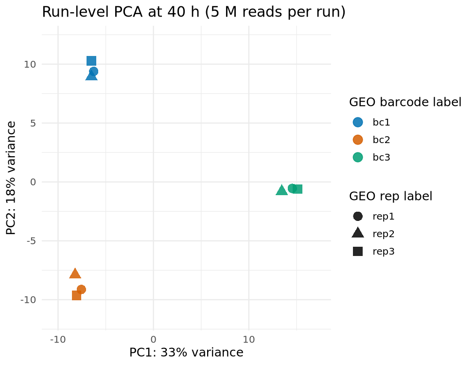
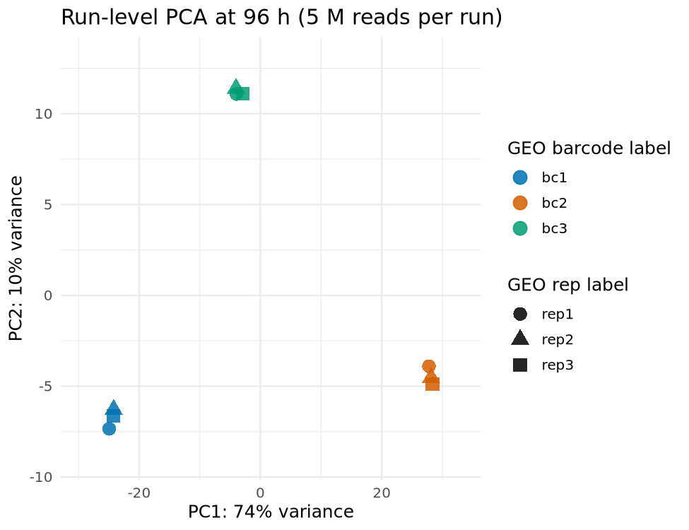
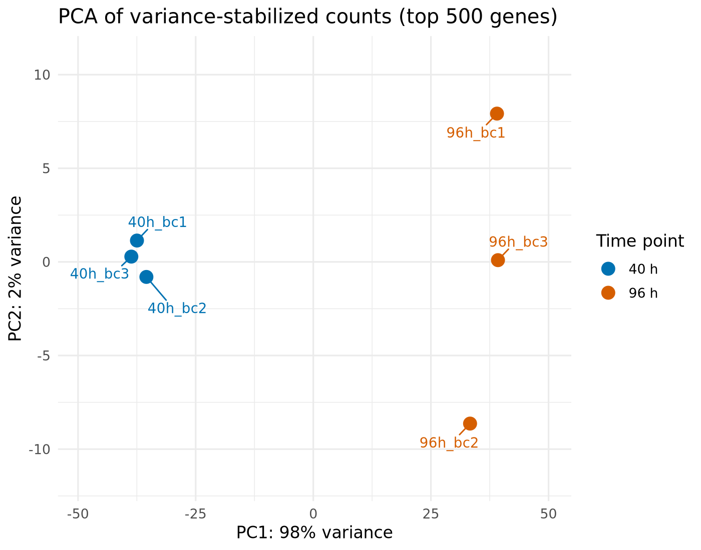
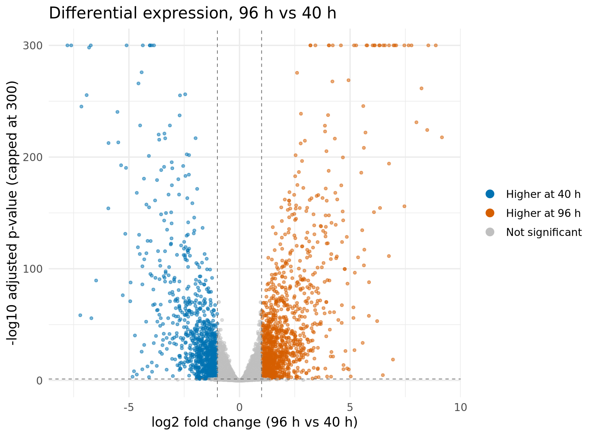
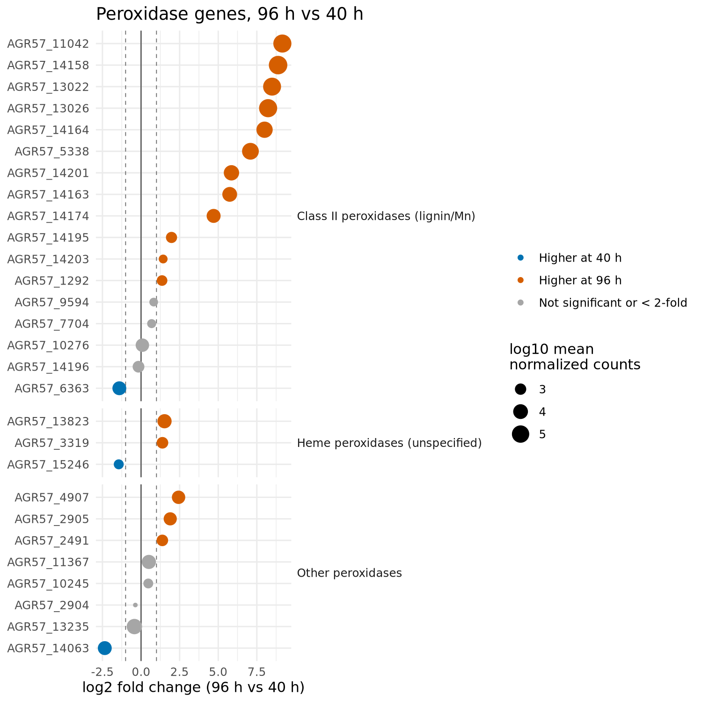

# RNA-seq Differential Expression: Onset of Ligninolytic Oxidation in *Phanerochaete chrysosporium*

Differential expression analysis of public RNA-seq data from the white-rot fungus *Phanerochaete chrysosporium* RP-78 growing on spruce wood, comparing 40 h and 96 h of colonization, the two time points that bracket the onset of ligninolytic oxidation (Korripally et al., 2015, *Applied and Environmental Microbiology*; GEO GSE69461). The analysis recovers strong induction of class II (lignin/manganese) peroxidase genes at 96 h.

## Key findings

- Replicate structure was verified before testing: a run-level PCA showed that the GEO "barcode" label, not the "rep" label, identifies the three biological pools per time point.
- 2,368 of 12,530 genes differ between 40 h and 96 h (padj < 0.05, abs(log2FC) >= 1); 1,409 remain significant when tested against a 2-fold threshold.
- Nine of 17 class II (lignin/manganese) peroxidase genes are induced about 26- to 570-fold at 96 h, while other peroxidase families change much less, consistent with the original report of ligninolysis onset.

## Context

This project builds on my MSc research on fungal laccases, a family of lignin-modifying enzymes. It applies a transcriptomics workflow (pseudo-alignment + DESeq2) to the peroxidase side of the same process in a well-characterized white-rot fungus. The sequenced strain and the reference genome are both RP-78.

## Data

| | |
|---|---|
| Study | GSE69461 / SRP058967 |
| Organism | *P. chrysosporium* RP-78 |
| Design | 3 biological replicate pools x 2 time points (40 h, 96 h), grown on spruce wood sections |
| Sequencing | Illumina HiSeq 2000, single-end (~100 bp) |
| Runs | 18 (each biological pool sequenced in 3 runs) |
| Reference | Ensembl Fungi release 63, assembly GCA_000167175.1 (13,602 protein-coding genes, one transcript per gene); gene descriptions from FungiDB |

## Replicate structure

GEO labels the 18 runs as "rep1-3 x barcode1-3". To determine which label corresponds to biological replication, each run was quantified separately (first 5 M reads) and a PCA was computed within each time point. The three runs sharing a barcode overlap almost completely, whereas the three barcodes form well-separated groups (separation of ~20-50 units versus ~1-2 units within a barcode). Barcodes were therefore treated as the three biological pools described in the original study, and the three runs of each barcode as technical re-sequencing, merged into one sample. This assignment is an inference from the data and from the paper's design (three replicate pools per time point), not an explicit statement in the GEO metadata.

## Pipeline

    SRA (18 runs) -> fasterq-dump -> fastp (QC + trimming) -> Salmon (3 runs merged per biological pool)
    -> tximport -> DESeq2 (96 h vs 40 h) -> validation with ligninolytic peroxidase genes

## Results

**Quality control.** 95.5-96.4% of reads passed fastp filters in every run; adapter content 1.6-3.5%; duplication 38-60% (expected for RNA-seq, where highly expressed genes generate many identical reads).

**Mapping (Salmon).** 66.6-69.1% of reads at 40 h and 73.9-79.7% at 96 h. These rates are lower than typical for RNA-seq. The read totals reported by the original study (2.5 x 10^8 at 40 h, 1.6 x 10^8 at 96 h) are about 67% and 77% of the reads deposited in SRA, close to these rates, which suggests that the original counts refer to mapped reads; this was not verified.

**Differential expression.** After filtering lowly expressed genes (at least 10 counts in at least 3 samples), 12,530 genes were tested.

| Criterion | Genes |
|---|---|
| padj < 0.05 and abs(log2FC) >= 1 | 2,368 (1,326 higher at 96 h; 1,042 higher at 40 h) |
| Same, tested against abs(log2FC) > 1 | 1,409 |
| Higher at 96 h, log2FC >= 2, padj < 0.05 | 450 (429 with mean expression >= 100) |

For comparison, the original study reported 356 genes at least four times higher at 96 h at relatively high levels. The criteria, gene models and quantification method differ, so only the order of magnitude is comparable.

*PCA uses the 500 most variable genes. In the volcano plot, adjusted p-values below 1e-300 are capped at 300 on the axis.*

**Validation: ligninolytic peroxidases.** Genes were grouped by FungiDB product description before looking at expression.

| Group | Genes | Higher at 96 h (padj < 0.05, log2FC >= 1) | Higher at 40 h | Median log2FC |
|---|---|---|---|---|
| Class II peroxidase / ligninase (lignin and manganese peroxidases) | 17 | 12 | 1 | 4.70 |
| Heme peroxidase (class unspecified) | 3 | 2 | 1 | 1.39 |
| Other peroxidases (glutathione peroxidase, chloroperoxidases, peroxiredoxin) | 8 | 3 | 1 | 0.49 |

Nine of the 17 class II genes are induced between ~26- and ~570-fold at 96 h, with very high expression (mean normalized counts from ~5,000 to ~340,000). The rest of the group is modestly induced (three genes, 2.6- to 3.9-fold), changes by less than 2-fold (four genes, two of them not significant), or is lower at 96 h (one gene). Other peroxidases change much less, with a few exceptions (three chloroperoxidase-like genes up 2.6- to 5.4-fold; a peroxiredoxin down ~5-fold). This agrees qualitatively with the original report of strongly upregulated lignin and manganese peroxidases at 96 h. Gene IDs of the original study (JGI v2.2) differ from those used here, so a gene-by-gene comparison was not possible.

Eight of the class II genes (AGR57_14158, 14163, 14164, 14174, 14195, 14196, 14201, 14203) lie within about 96 kb of scaffold PchrRP-78_SC019, and five of them are among the most strongly induced (log2FC 4.7 to 8.9). Clustering of lignin peroxidase genes is described in the genome publication (Nature Biotechnology, 2004), which uses a different scaffold numbering, so the two clusters cannot be matched by name.

Full table: [`results/deseq2/peroxidase_genes_results.csv`](results/deseq2/peroxidase_genes_results.csv).

## Conclusion

Between 40 h and 96 h of colonization of spruce wood, *P. chrysosporium* RP-78 undergoes a large transcriptional shift: 2,368 of 12,530 tested genes pass the conventional criterion (padj < 0.05, abs(log2FC) >= 1), and 1,409 remain significant when tested against a fold-change threshold of 2. The shift includes strong induction of the ligninolytic machinery at 96 h: nine of the 17 class II (lignin/manganese) peroxidase genes are induced between about 26- and 570-fold at very high expression, whereas other peroxidase families change much less. This agrees qualitatively with the original report of upregulated lignin and manganese peroxidases at the onset of ligninolysis.

Verifying the replicate structure before differential testing was essential here: the GEO labels were ambiguous about which runs are biological replicates, and a PCA on separately quantified runs resolved it. With only three pooled replicates per time point and low estimated dispersion, results are interpreted by effect size and expression level rather than by adjusted p-values alone.

## Limitations

- Replication: three pooled biological replicates per time point and low estimated dispersion (median 0.0037), probably because each pool combines about 20 wood sections. Adjusted p-values are very small even for modest changes, so gene lists are interpreted by effect size and expression level, not by p-value alone.
- Comparison with the original study is qualitative: it used genome version v2.2 (JGI) and a different quantification pipeline, and its gene IDs cannot be matched one-to-one to the Ensembl Fungi/FungiDB annotation used here. Only the order of magnitude of induced genes and the direction of change of the peroxidase families are comparable.
- No independent experimental validation (the original study used quantitative RT-PCR); the peroxidase analysis is a computational consistency check.

## Possible extensions

- Functional enrichment (GO) of the differentially expressed genes. It requires a gene-to-GO table for this annotation, which was not assembled here.
- Separating lignin, manganese and versatile peroxidases within class II (for example, by sequence similarity to characterized enzymes), since FungiDB descriptions only say "Class II peroxidase".
- Re-analysis against a strain-matched, more recent genome annotation if one becomes publicly available.

## Technologies

SRA Toolkit, fastp, MultiQC, Salmon, R (tximport, DESeq2, ggplot2, ggrepel), tmux.

## Reproducing

Create the environment from `environment.yml` and run the scripts in `scripts/` from the project root, in this order: `01_prepare_reference.sh`, `02_download_and_trim.sh`, `03_replicate_structure_test.sh`, `04_quantify.sh`, `05_differential_expression.sh`. The 18 runs are listed in `annotation/run_accessions.tsv`. The scripts consolidate the commands used interactively for this analysis. Reference and raw data are not versioned.
